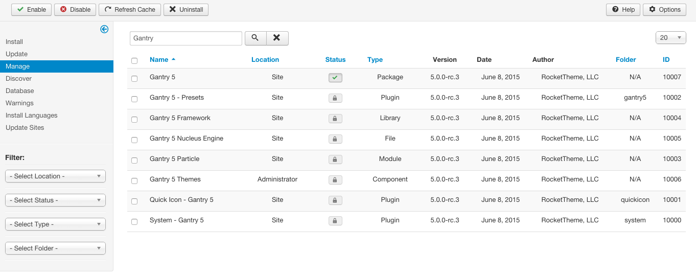

The Gantry framework itself is independent of any theme. Each Gantry-enabled theme relies on the Gantry framework to provide the underlying base and extensive functionality that enables the creation of such powerful sites. While a Gantry-powered theme does require the Gantry framework to work properly, Gantry is not inherently built in to the theme, itself.

Downloading Gantry
------------------

Gantry requires to major parts to function. The first is the Gantry framework itself, a collection including the Gantry component, library, and associated plugins. This is the base by which the second part, a Gantry-powered theme functions. 

* **Gantry 5**: This contains the Gantry 5 framework and its associated bits and pieces (library, component, and plugins).
* **Theme**: This contains just the theme/template.

The installation process is exactly the same for each of these. The only difference is the file you are installing. The Gantry 5 component should be installed prior to a Gantry theme.

<a href="http://gantry.org/downloads" class="button"><i class="fa fa-fw fa-download"></i> Download Gantry 5 and the Hydrogen Theme</a>

>>> Prior to the first full release of Gantry 5, the **Framework** and **Theme** are being distributed in different installable packages.

## Installing the Gantry Framework



[plugin:youtube](https://www.youtube.com/watch?v=zCH10qrxPSc)

Install the **Gantry Framework** package file (named similarly to `pkg_gantry5-v5.0.0.zip`) by navigating to **Extensions → Extensions Manager → Install** and selecting the **Choose File** button. Locate the downloaded ZIP and click **Upload & Install** to begin the installation process.

 {.border .shadow}

After installing the Gantry Framework package, all of the Gantry extensions will appear in the **Extensions Manager**.

 {.border .shadow}

If you are having any issues, including the following error messages:

* `Failed to load 'g5_hydrogen' template: Please install Gantry5 Framework!` 
* `Error - Please install Gantry5 Framework!`
* `Error - Gantry5 Templates: Please enable 'System - Gantry5 Framework' plugin!`

You will want to make sure that all of Gantry's associated extensions are enabled. To do so, simply select any non-enabled extensions listed in the image above, and activate them by selecting the **Enable** button in the upper-left area of the **Extensions Manager**.




>>> WordPress support is coming soon.

To install the Gantry template, you'll need to navigate to **Plugins → Add New** in the admin area of WordPress. From here, select the **Browse** button, locate the downloaded ZIP file, and click **Install Now** to begin installation.

 {.border .shadow}

The Gantry template will appear in **Themes**, the Gantry plugins will appear in **Plugins**.


{{ gravui_tabs({'Joomla':tab1, 'WordPress':tab2}) }}

## Installing a Gantry Template



Install at **Extensions → Extensions Manager → Install**. Select the **Choose File** button, locate the downloaded ZIP and click **Upload & Install** to begin the installation.

 {.border .shadow}

The Gantry template will appear in the **Template Manager**, and all Gantry extensions will appear in the **Extensions Manager**.




Coming soon...


{{ gravui_tabs({'Joomla':tab1, 'WordPress':tab2}) }}

## Setting a Gantry Template as Default



If you are using the Gantry template, you will want to set it as the default template so it loads on the front end. Go to **Extensions → Template Manager**, select the **gantry** checkbox, and click **Default** in the button toolbar.

>>> For some Gantry-powered templates, this will happen automatically upon installation. This is a time-saving step intended to speed up deployment and reduce confusion for new users. We rec

 {.border .shadow}




Coming soon...


{{ gravui_tabs({'Joomla':tab1, 'WordPress':tab2}) }}
