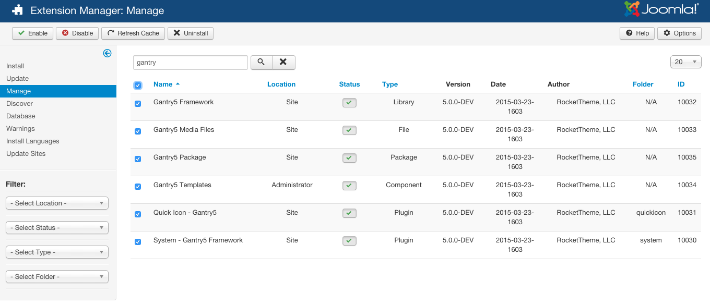
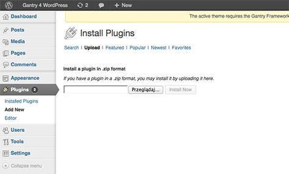
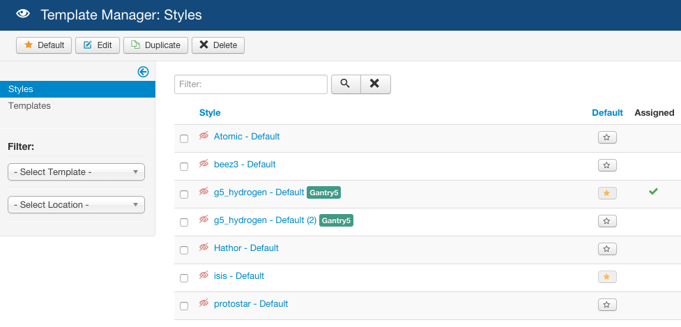

The Gantry framework itself is independent of any template. Each Gantry-enabled template relies on the Gantry framework to provide the underlying base and extensive functionality that enables the creation of such powerful sites. While a Gantry-powered template does require the Gantry framework to work properly, Gantry is not inherently built in to the template, itself.

Downloading Gantry
------------------

Gantry has three available download types:



* **Bundle**: This includes the Framework (library, component & plugins), the Gantry template and associated extensions.
* **Framework**: This contains only the Framework (library, component & plugins).
* **Template**: This contains just the Gantry template.

The installation process is exactly the same for all three. The only difference is the file you are installing. Select the download option best for you. We recommend the bundle for first-time installs.

<a href="http://www.gantry-framework.org/download#joomla" class="button"><i class="fa fa-fw fa-download"></i> Download</a>




>>> WordPress support is coming soon.

* __Framework__: This contains only the Framework plugin.
* __Theme__: This contains just the Gantry theme.
* __RocketLauncher__: This includes the full WordPress installation, Framework (plugin) and the pre-configured Gantry template (only for NEW installations).

The package you choose to install makes a difference in terms of where you'll be installing the files. **Gantry Framework for WordPress** should be installed like a standard WordPress plugin. The **Gantry Default Theme for WordPress** should be installed the same way you would install any other theme. 

>>>>> Keep in mind that you will need the Gantry framework installed for any Gantry themes to work.

If you don't have WordPress installed on your server yet, you can use the **RocketLauncher** package. It contains the full pre-configured Gantry environment, and is essentially a complete WordPress installation. Choose whichever download option is best for you. We recommend the **RocketLauncher** for first-time WordPress installations.

<a href="http://www.gantry-framework.org/download#wordpress" class="button"><i class="fa fa-fw fa-download"></i> Download</a>


{{ gravui_tabs({'Joomla':tab1, 'WordPress':tab2}) }}

## Installing the Gantry Framework



Install the **Gantry Framework** package file (named similarly to `pkg_gantry5-v5.0.0.zip`) by navigating to **Extensions → Extensions Manager → Install** and selecting the **Choose File** button. Locate the downloaded ZIP and click **Upload & Install** to begin the installation process.

 {.border .shadow}

After installing the Gantry Framework package, all of the Gantry extensions will appear in the **Extensions Manager**.

 {.border .shadow}

If you are having any issues, including the following error messages:

* `Failed to load 'g5_hydrogen' template: Please install Gantry5 Framework!` 
* `Error - Please install Gantry5 Framework!`
* `Error - Gantry5 Templates: Please enable 'System - Gantry5 Framework' plugin!`

You will want to make sure that all of Gantry's associated extensions are enabled. To do so, simply select any non-enabled extensions listed in the image above, and activate them by selecting the **Enable** button in the upper-left area of the **Extensions Manager**.




>>> WordPress support is coming soon.

To install the Gantry template, you'll need to navigate to **Plugins → Add New** in the admin area of WordPress. From here, select the **Browse** button, locate the downloaded ZIP file, and click **Install Now** to begin installation.

 {.border .shadow}

The Gantry template will appear in **Themes**, the Gantry plugins will appear in **Plugins**.


{{ gravui_tabs({'Joomla':tab1, 'WordPress':tab2}) }}

## Installing a Gantry Template



Install at **Extensions → Extensions Manager → Install**. Select the **Choose File** button, locate the downloaded ZIP and click **Upload & Install** to begin the installation.

 {.border .shadow}

The Gantry template will appear in the **Template Manager**, and all Gantry extensions will appear in the **Extensions Manager**.




Coming soon...


{{ gravui_tabs({'Joomla':tab1, 'WordPress':tab2}) }}

## Setting a Gantry Template as Default



If you are using the Gantry template, you will want to set it as the default template so it loads on the front end. Go to **Extensions → Template Manager**, select the **gantry** checkbox, and click **Default** in the button toolbar.

 {.border .shadow}




Coming soon...


{{ gravui_tabs({'Joomla':tab1, 'WordPress':tab2}) }}
