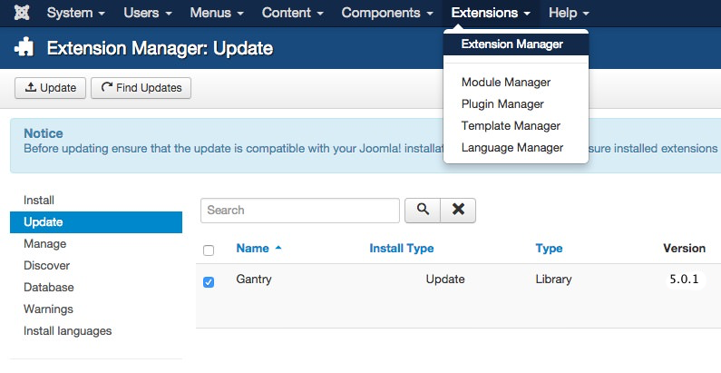



There are several parts to Gantry: The library, component, plugin, and template -- and each have a similar upgrading process.

There are two methods of upgrading the Gantry Library. You can either do so via the Joomla Updater, or through an overriding reinstall. The first is the simplest and recommended method. Go to **Extensions → Extensions Manager → Update**, select **Find Updates** to load all available updates, if they are not already shown. Then, select Gantry and click **Update**.. Gantry will now be updated directly from the Web.

 {.border .shadow}

The alternative method is actually identical to installing Gantry in the first place, and necessary for upgrading the Gantry template. You would just need to download the latest Gantry files, and install at **Extensions → Extensions Manager → Install**. Select the **Choose File** button and locate the downloaded ZIP and click **Upload & Install** to begin the update. There is no need to uninstall first as the files will be updated during the installation process.

 {.border .shadow}

You can check to see if the correct Gantry version has been installed by going to **Extensions → Extensions Manager → Manage**, and searching for Gantry. The version number will appear in the table.




>>> WordPress support is coming soon.

Upgrading the Gantry Framework plugin is a relatively straightforward and simple process. This can be done using the built-in WordPress updater. Go to **Admin Dashboard → Updates**, select **Check Again** to load all available updates. Then check the checkbox next to the Gantry Template Framework and click **Update Plugins**.. Gantry will now be updated directly from the web.

 {.border .shadow}

Alternatively, you can upload the updated version via FTP. You would just need to download the latest [Gantry files](http://code.google.com/p/gantry-framework/downloads/list?can=3&q=platform%3DWordPress), extract them and overwrite the whole `gantry` directory under `wp-content/plugins`. There is no need to uninstall first, as the files will be overwritten during the FTP upload.

You can check to see if the correct Gantry version has been installed by going to **Plugins** and searching for Gantry. The version number will appear in the resulting table.


{{ gravui_tabs({'Joomla':tab1, 'WordPress':tab2}) }}

