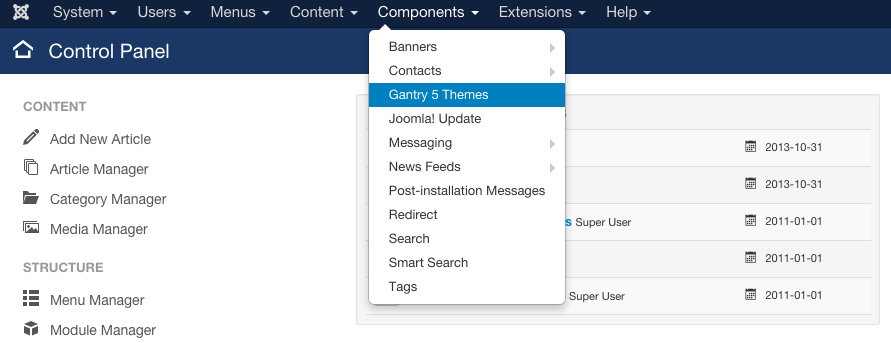
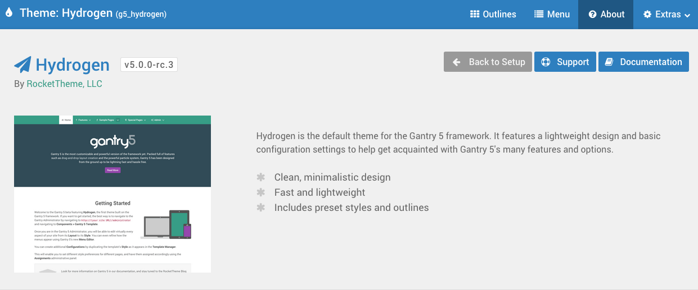
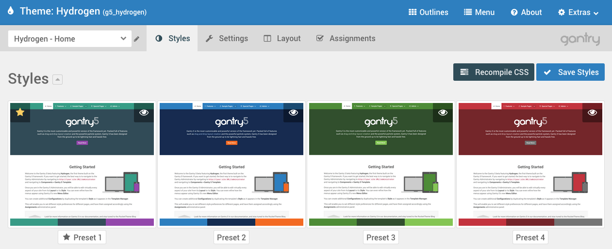
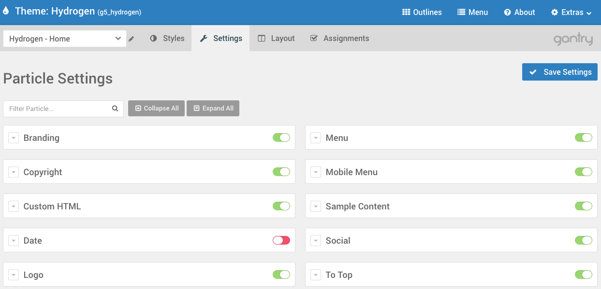
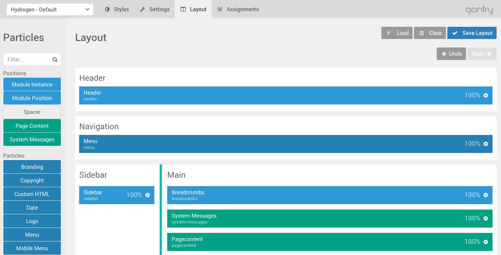
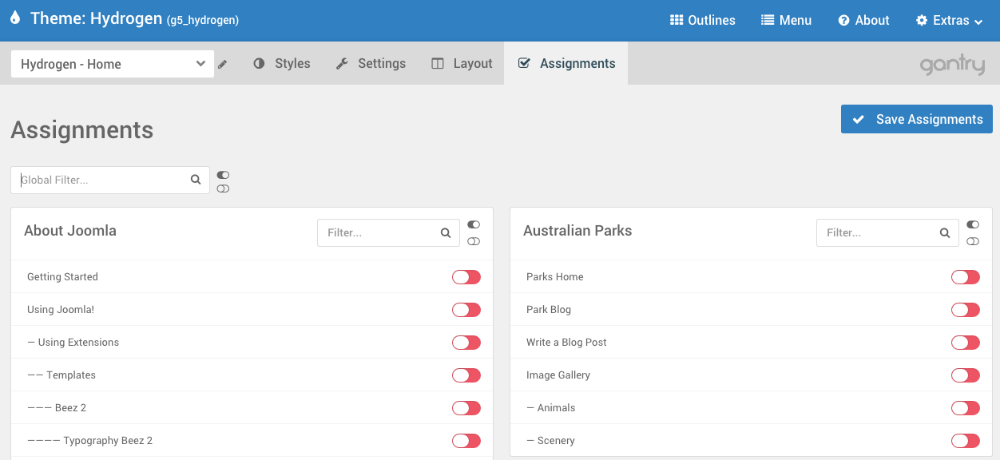

The **Gantry Admin** is a collection of settings used to set up and configure a Gantry-powered theme. It acts as a central command center for pretty much everything and anything you need to change related to the theme, layout, presets, menu, and assignments.

You can reach the Gantry Admin by following these steps:



[plugin:youtube](https://www.youtube.com/watch?v=JWKpeFRqcDI)

The first thing you will need to do is ensure that the Gantry Framework and a Gantry-enabled template is installed and active. You can find detailed step-by-step instructions for this in [our guide](../../basics/installation).

 {.border .shadow}

Once this is done, navigate to **Administrator > Extensions > Template Manager** and select the Gantry-powered template you wish to configure. This should take you to the **Overview** section of the Gantry Admin for that template.

 {.border .shadow}

Alternatively, you can access the Gantry 5 administrator by navigating to the **Control Panel** in the backend of Joomla and selecting **Gantry 5 Templates** in the sidebar to the left under the **Extensions** section.

 {.border .shadow}

There is a third method, which is easily accomplished by navigating to **Components > Gantry 5 Templates** in the administration menu in the backend of Joomla.




>>> WordPress support is coming soon.

The first thing you will need to do is ensure that the Gantry Framework and a Gantry-enabled theme is installed and active. You can find detailed step-by-step instructions for this in [our guide](../../basics/installation).

Once this is done, navigate to **Administrator > (Theme Name) Theme >**. This should take you to the **Overview** section of the Gantry Admin for that theme.


{{ gravui_tabs({'Joomla':tab1, 'WordPress':tab2}) }}

Admin Panels
-----

Each tab located near the top of the **Gantry Admin** gives the user quick access to various elements of the Gantry-powered theme's settings. These sections, referred to as *Panels*, make it easy to quickly navigate to the setting you need to adjust. 

There are two different types of panels. The first, located along the very top of the **Gantry Admin**, are global settings which affect not only your selected configuration, but the site as a whole. These include the **Menu** and **About** panels. Additionally, you can use the **Configuration** panel to manage and create new configurations for your site.

The second type of panels are available on the gray tabs bar and they enable you to refine settings for the presently-selected configuration. These **Configuration-specific** panels make it possible for you to give each page of your site a unique look, visually setting your front page apart from your About page, for example.

A quick description of each of these panels can be found below.

### Global Admin Panels

The **Global Admin Panels** do not affect a single Configuration, but have influence over the entire theme. These panels enable you to do things like switch between and edit individual Configurations, edit and configure the Menus, and find out more about the Gantry-powered theme. 

#### Configurations

>>>> The Configuration panel is not available in the initial beta release of Gantry 5. We will update this documentation when available.

 {.border .shadow}

This panel is where you can manage and create new configurations, each with its own set of layout, style, assignments, and particle settings. There are two types of configurations, Standard and System. 

**Standard Configurations** can be created by the user, based on one of several available **Layout Presets**, and assigned to various page types to give them a unique layout and/or set of settings. Your **Default** configuration acts as the **Master** configuration did in Gantry 4, with all other configurations being overrides which enable you to change settings to meet the needs of a specific page.

The **System Configurations** are core configurations which are linked to specific page types, such as 404 or Offline. These configurations can be edited, but can not be created or renamed, as they are core to Gantry.

You can switch to an individual Configuration in two ways. This panel will enable you to set a specific Configuration as active in the Configuration-specific panels of the Admin by clicking their associated **Edit** buttons. Alternatively, you can switch between them using the drop-down menu located on the left-hand side of the toolbar which hosts the **Configuration-specific Admin Panels**.

#### Menu

 {.border .shadow}

The **Menu Editor** makes it easy to configure and add information to menus as they appear on your site. Virtually every aspect of the menu's appearance and arrangement can be altered from this panel. 

The Gantry menu system grabs information from the CMS' own menu system, and creates an override that enables you to rearrange items and configure it the way you would like it to appear on the frontend. These customizations are then served to the visitor. The changes you make to the menu does not impact the way the CMS uses the menu. If you need to make changes to page ordering or any other CMS-specific property, you will still need to do this from the native menu manager.

#### About

 {.border .shadow}

The **About** panel enables the theme developer to place information about the theme, such as a feature list and credits, as well as links to documentation and a reference screenshot. This is also where users can quickly find the currently-enabled theme name, version number, and developer information.

### Configuration-specific Panels

**Configuration-specific Panels** offer users the ability to customize the layout, settings, and assignments of a specific Configuration. In Gantry4, Configurations were referred to as overrides.

#### Styles

 {.border .shadow}

The **Styles** panel makes it easy to quickly adjust visual bits and pieces related to the Gantry-powered theme. This can include color-coded presets, fonts, accent colors and colors for specific portions of the page, as well as custom elements such as colors, block styles, and backgrounds. Basically, anything affected by CSS related to page design can be configured here.

#### Settings

 {.border .shadow}

The **Settings** panel is a virtual command center for Particles. This is where you can quickly toggle Particles on and off, as well as configure their global settings.

#### Layout

 {.border .shadow}

This is the **Layout Manager** panel which enables you to arrange Particles, content, and widget/module positions for your theme. This panel is essentially where you set up how the page's elements will be arranged, and what they will include. Additionally, you can access individual settings for Particles, Blocks, Sections, and Grids. 

#### Assignments

 {.border .shadow}

The **Assignments** panel is your one-stop-shop for assigning Configurations to specific pages. For example, if you have a Configuration set up that you would like to apply specifically to your **About** page, you can do so here.

