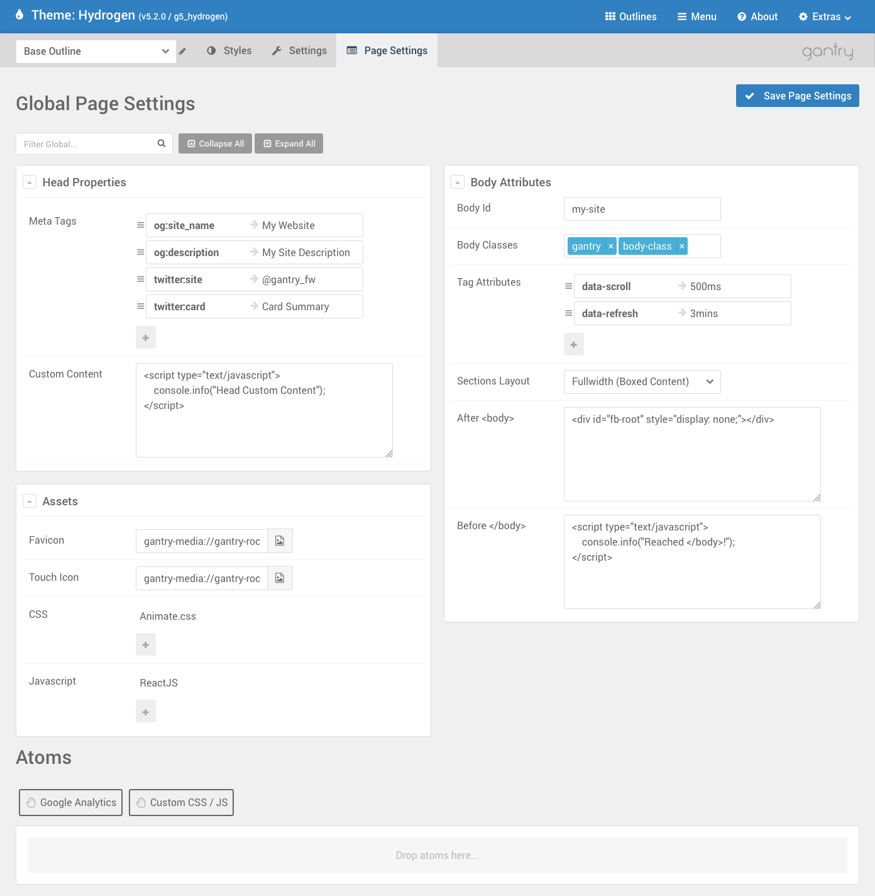
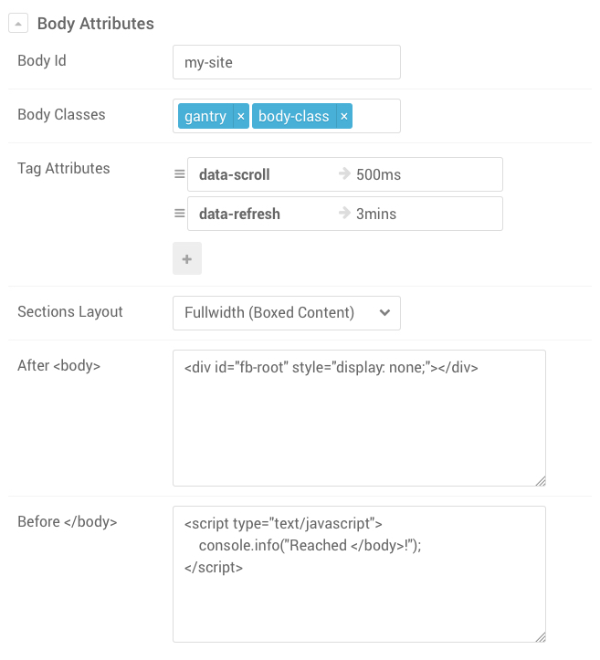

The **Page Settings** allows to extend the output of the page by letting you include additional elements. Think of the **favicon**, a Facebook or Twitter **Meta Tag**, a JavaScript or CSS file. All of these elements are meant to be shared across the entire site and Page Settings is what let's you do so.

In the traditional template approach, to add any of these elements you would need to manually edit the file that includes the structure of the page, usually an `index.php` file. Page Settings simplify this process exponentially by abstracting the manual editing labor into a simple and powerful form right into the admin.

Thanks to the Gantry's core concept and implementation of overrides, Page Settings can be global as well as singularly overridden for each Outline, if ever needed.
 

Controls
-----

 {.border .shadow}

The **Save Page Settings** button applies any changes you have made to the **Page Settings** administrative panel to its associated outline. These changes apply as the new default for the setting for that outline only, and will only become a global default if you are using the theme's assigned base outline.

>>>>> Like in the [Settings Panel](../settings#controls), overrides, filtering and collapsing work the same way.

Head Properties
-----

 {.border .shadow}

The **Head Properties** block allows to customize anything that goes in between `<head></head>`. Often times you want to add Meta Tags for Facebook or Twitter, or perhaps you simply want to add something custom. 

The screenshot above shows one of the many possible ways you could compile Head Properties.
 
### Meta Tags

Meta Tags is a Collection field that takes a list of keys and values, combines them and renders inside `<head></head>` in the form of a `<meta>` property.
The use of Meta Tags is countless, usually Meta Tags are used to better structure how a site gets displayed when embedded in Facebook or Twitter.

More details about Facebook's Open Graph and Twitter's Cards Meta Tags can be found at the following locations:

- [https://developers.facebook.com/docs/sharing/webmasters](https://developers.facebook.com/docs/sharing/webmasters)
- [https://dev.twitter.com/cards/markup](https://dev.twitter.com/cards/markup)
- [https://dev.twitter.com/cards/getting-started](https://dev.twitter.com/cards/getting-started)


Body Attributes
-----

 {.border .shadow}

**Body Attributes** allows to customize the attributes for the `<body>` tag as well as inject content right after `<body>` opens or right before `</body>` closes.

### Body Id and Body Classes

The **Body Id** field allows to specify an id for the `<body>`. While **Body Classes** allow to add additional personal classnames. Following the example in the screenshot above, the resulting output will look something like:

```html
<body id="my_app" class="... gantry ...">
```

### Tag Attributes

**Tag Attributes** is a Key/Value field that allows to render additional custom attributes for the `<body>`. Considering the screenshot example of above, imagine to have loaded a script that allows to customize the scroll speed and page auto refresh via `data-scroll` and `data-refresh`.
 
 The resulting output will look like so:
 
 
```html
<body id="my_app" class="... gantry ..." data-scroll="500ms" data-refresh="3mins">
```

### After `<body>` and Before `</body>`

Sometimes you need to inject styles, scripts or elements to the page and they need to be inserted either at the beginning or the end of `<body>`.

A great example was [Facebook's SDK for JavaScript](https://developers.facebook.com/docs/javascript/quickstart/v1.0) at its version 1.0. Back then Facebook was requiring the site to provide a `<div id="fb-root"></div>` right after the `<body>` tag opened. As you can see from the screenshot example above, that would have been the perfect place for it.

You will often see scripts requiring that you do render elements up front in the page and instead of creating new Modules, Particles or Widgets, you can simply add your element in here. Popups are also a good example. The content of the modal is rendered in the page but invisible, until an element triggers the popup to open.
 

Assets
-----

 {.border .shadow}

**Assets** is a dedicated section for injecting specific CSS/JS or Favicons to the site. Even though anything you can do in Assets you could do with just [Head Properties](#head-properties) and [Body Attributes](#body-attributes), we decoupled these portions to its own section.

Assets serve a very important role in custom templating. Including 3rd party scripts or styles has become very common and for this very reason, having a dedicated section to keep everything well organized is important.
 
### Favicon and Touch Icon

The **Favicon** and **Touch Icon** allow to assign an image to the site that will then represent in form of an icon for the browser tab or in your device home screen.

Both fields are very similar, the **Favicon** field uses the more traditional way of rendering and associating an icon to the site. In the past this has been always represented with a **16x16** or **32x32** icon size file.

Nowadays with the advent of touch devices and the possibility of saving into bookmarks or home screens a whole site, new standards have arised allowing for bigger and more detailed icons. **Touch Icon** covers this and allows to let the devices be aware that your site can use icons with higher resolutions.

If you want to use **Touch Icon**, it is adviced that you create an image that is at least **180x180** or **192x192**. Devices with a smaller resolution will adapt and downscale the image but the higher resolution will benefit of a nice looking icon.

>>> Gantry only covers the most common use of Touch Icons and supports iOS, Android and Windows. It also only downscales icons. If you are looking for a more sophisticated use of this and more targeted sizes, refer to [this article](https://mathiasbynens.be/notes/touch-icons). You can also use [online tools for generating icons](http://realfavicongenerator.net/). The perfect place for adding custom generated icons code is [Head Properties: Custom Content](#head-properties).

### CSS and JavaScript

Both **CSS** and **JavaScript** Collection fields work identically to the [Custom CSS/JS Atom](../../particles/atoms#custom-css-js). The benefit of adding Assets from the Page Settings is that they will be global to the site and you won't need to Drag and Drop an Atom to the Layout anymore.

