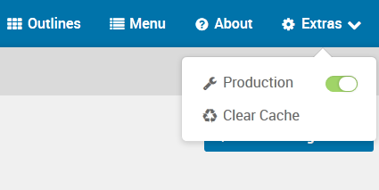
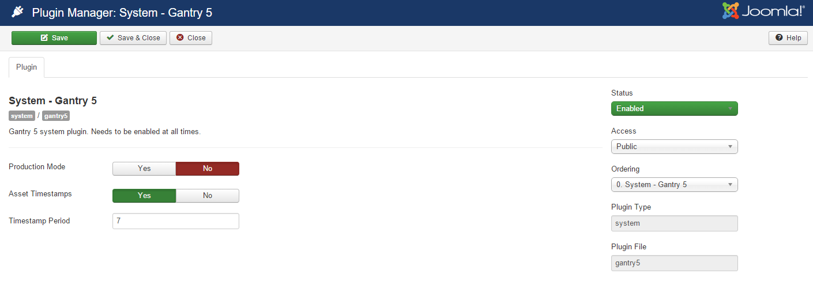



 {.border .shadow}




 {.border .shadow}


{{ gravui_tabs({'Joomla':tab1, 'WordPress':tab2}) }}

The **Extras** dropdown gives you quick access to a few options that are handy to have instant access to throughout the administrator. This includes the **Development Mode** toggle switch, a **Clear Cache** shortcut, and a shortcut to **Platform Settings** which takes you to a platform-specific settings page for Gantry.

## Development and Production Modes

There is a process running in Gantry 5 that enables you to activate **Develop** and **Production** modes. The **Development** toggle switch in the **Extras** areas of the Gantry administrator enables you to toggle between these modes as needed.

When in **Development**, any change made to the `custom.scss` file will be detected by Gantry, triggering an automatic recompilation of the file. This makes it easy to make changes on the fly and have them appear on your site without any extra action required on your part.

In the future, more **Development** vs. **Production** actions will be tied to this same setting, such as cache, minified vs. extended JS/CSS, etc.

#### Alternative Toggle Access
 


 {.border .shadow}

There is an alternative method for toggling this feature, accessible by navigating to **Administrator → Extensions → Plugin Manager** and selecting the **System - Gantry 5** plugin.




This is currently the recommended, primary method for toggling Development and Production mode in WordPress.


{{ gravui_tabs({'Joomla':tab1, 'WordPress':tab2}) }}

## Clear Cache



The **Clear Cache** shortcut clears Gantry's cache instantly. This includes everything stored in the `SITE_ROOT/cache/gantry5/` directory. If you are having any issues in the Gantry administrator, this is an excellent first step to take prior to more detailed troubleshooting.




The **Clear Cache** shortcut clears Gantry's cache instantly. This includes everything stored in the `SITE_ROOT/wp-content/cache/gantry5/` directory. If you are having any issues in the Gantry administrator, this is an excellent first step to take prior to more detailed troubleshooting.


{{ gravui_tabs({'Joomla':tab1, 'WordPress':tab2}) }}

## Platform Settings



The **Platform Settings** shortcut takes you to a platform-specific settings page for Gantry 5. In Joomla, for example, you will be taken to the component configuration page for Gantry 5 (which typically handles advanced permissions configuration).




WordPress does not currently have a Platform Settings option as it does not have an equivalent component to that which is present in Joomla.


{{ gravui_tabs({'Joomla':tab1, 'WordPress':tab2}) }}

