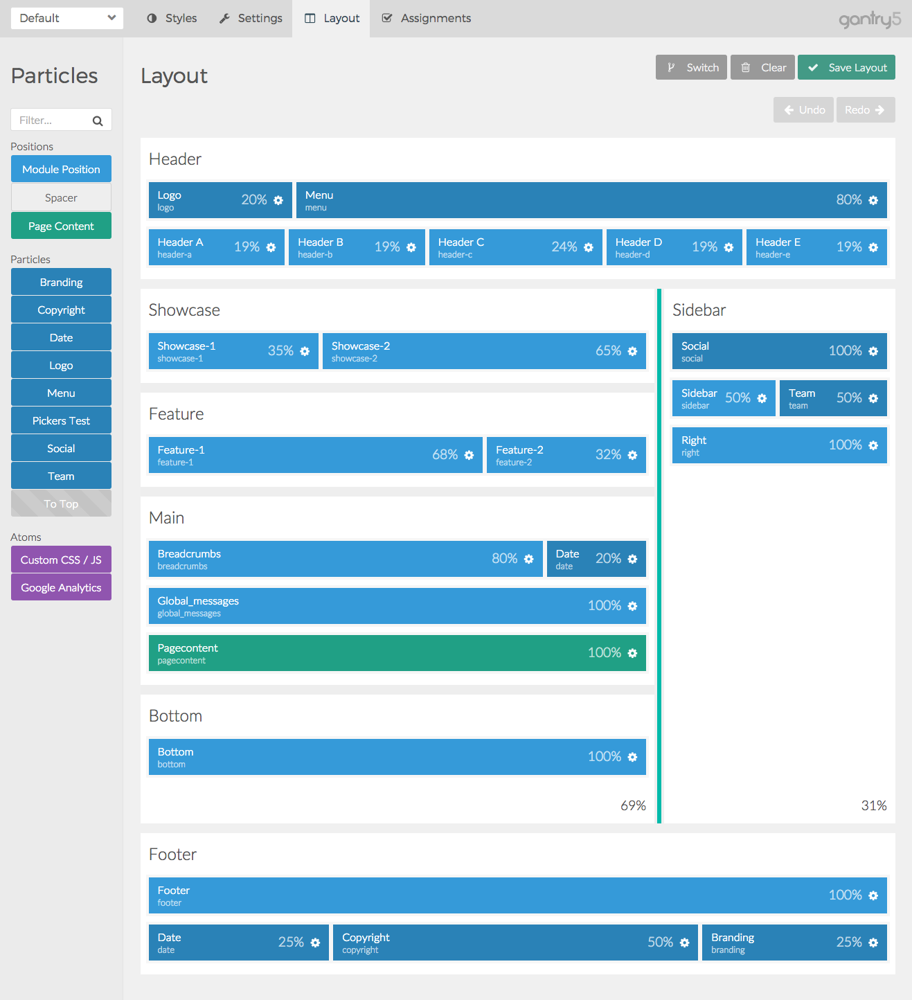
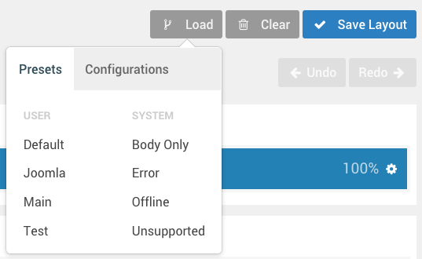
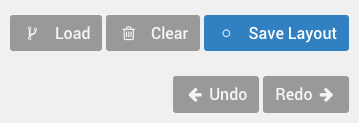
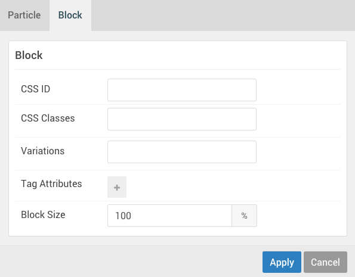
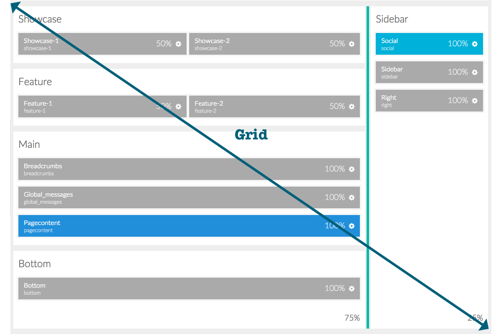

The **Layout Manager** in the Gantry-based theme administration interface provides several options for setting up the layout of the theme's Configurations. 

Using the Load Button
-----

**Layout Presets** enable you to quickly switch between pre-configured layouts for your site. These layouts are included in the theme and feature a different set of sections. Some layout presets may include a sidebar, or multiple sidebars, and a number of sections intended to fit a specific page style.

Each **Configuration** is assigned a **Layout Preset** which can be reassigned using the **Load** button in the **Layout Manager**. Once you have selected this button, a pop-up will appear with two tabs, **Presets** and **Configurations**.

If you select a **Preset**, your layout will be replaced with a preset one that comes with the theme. These presets act as starting points for your design, giving you a set of **Sections**, **Positions**, and/or pre-placed **Particles** to work with. The presets have been configured to cover a range of possible layouts a user would want to use on their design, as set by the theme creator. This includes layouts with and without sidebars, and range from incredibly simple to complex.

Selecting on one of the **Configuration** options will copy the **Layout Manager** setup from the selected Configuration and load it into the one you are working in. This is a quick way to base your layout on another Configuration without having to manually duplicate it.

>>>> In the initial beta, your Layout Preset will automatically replace any **Particles** or **Positions** you have assigned. In the future, we plan to have it keep your changes across presets as long as these Particles are placed in sections that exist across presets.

Controls
-----

The **Layout Manager** has a number of useful controls to help you configure, save, import, and export your layouts. In this section, will we go over some of the things you will find in the **Layout** administrative panel.

### Load

As covered in the above section, the **Load** button gives you the opportunity to load a **Layout Preset** based on pre-assembled presets included with the theme or on the **Layout** of another **Configuration**.

## Clear

The **Clear** button wipes out the Particles (including Positions, Standard Particles, and Atoms) from the **Layout Manager** and gives you a blank slate with just the **Sections** kept.

### Save Layout

The **Save Layout** button is a quick and easy way to save the current layout, its particle, and settings to the active Configuration. This is the button you would click before switching tabs to the frontend and refreshing the page to check your changes.

### History

The **History** buttons give you the ability to go back and forth between changes you have made in your Layout. This history is persistent through the current session, and make it easy to go backwards and forwards, saving once you have reached a point you are happy with.

You can even go back after hitting **Save Layout**, should one of your changes not come out the way you expected after checking the frontend.

Particles
------

The **Particles** section (which appears along the left-hand side of the **Layout Manager**) is where you will find click-and-dragable **Positions**, **Particles**, and **Atoms**. You can perform a quick search in the **Filter** field to narrow down the list to find just the option you are looking for.

Once you have decided on an item you would like to apply to the layout, simply **click and drag** it to the desired place on the Layout.

These items will apply based on their default settings as set in the **Settings** administrative panel for the active Configuration. You can override these settings and apply a unique, specific set of settings on each individual particle from the main Layout area of this panel.

Layout
-----

The layout consists of several different sections, each with its own set of settings that enable you to customize the behavior and look of your site on the frontend. 

### Sections

For the Layout, the most basic parts of the page are **Sections**. These named divisions of the page give you the ability to create sections of content, each with one or more horizontal grids on which you can place **Blocks**, including **Particles**, **Positions**, and **Atoms**.

You can add **Grids** by selecting the **plus (+)** icon in the upper-right corner of a **Section**. This will create a new row at the bottom of the Section which you can click and drag to move it as needed.

#### Settings

| Setting    | Description                                         |
| :------    | :----------------------------------                 |
| Class      | Enables you to add a CSS class for the Section.     |
| Attributes | Enables you to add HTML attributes for the Section. |

The **Section** settings give you the ability to change the way a particular section renders and behaves on the frontend. By adding a **custom CSS class**, or **HTML attributes**, you can do things like change the way the section looks and add properties such as JS and other extras that aren't included in the base theme.

### Grids

Grids are the horizontal rows in which Blocks live. In a Grid, you can place Particles, Positions, and Atoms. These items, when located in a Grid are called Blocks, and can be freely moved and resized.

#### Settings

Grids have very basic options. You can **move** them using the icon on the left-hand side or quickly **even out Block widths** by selecting the icon on the right-hand side.

### Blocks

Blocks are the Lego bricks of the Layout Manager. These are your individual pieces which make up the individual parts of your page. Your Logo, for example, would be a **Particle** placed in a **Block**, which sits in a **Grid** within a **Section**.

Resizing Blocks in a Grid is a simple process. Simply move your mouse cursor (or tap your finger in a touchscreen) on the dividing line between blocks and drag it left or right, depending on how you want it to go. 

The only type of Particle that can't be resized is the **Atom** which is a non-visible piece of script, such as Google Analytics or custom CSS / JS which affects the entire page.

#### Settings

Each block has its own settings, which can be accessed by selecting the cog-wheel icon on the left-hand side of the Particle. These settings override the default ones set in the **Settings** admin panel, and become unique to the single block. 

These are **Particle** level settings, which exist in every type of Block. They enable you to rename the Particle as it appears on the Layout Manager, as well as to configure Particle-specific settings.

| Setting    | Description                                                                                                  |
| :------    | :----------------------------------                                                                          |
| ID         | Enables you to set an ID attribute.                                                                          |
| Class      | This is where you would enter any CSS class you would like to have apply to the Block.                       |
| Attributes | This field is where you would add any other HTML attributes to the Block.                                    |
| Size       | This field gives you the ability to set a specific size (in percentage) the Block will take up horizontally. |

The Block settings make it easy to change the way a particular block looks and behaves, as well as gives you the ability to set a specific width percentage for the Block.

### Sidebar Blocks and Grids

In the presence of a Sidebar, there is a unique situation. For the purposes of theme development, the sidebar and any horizontally-adjoining Sections are placed in a single Grid. Unlike the smaller Grids which exist inside sections, this Grid can't be freely moved. However, you can resize them using the divider bar between the Sidebar and its adjoining Sections.

The Sections next to the sidebar are all within a single Block, as is the Sidebar section itself.
