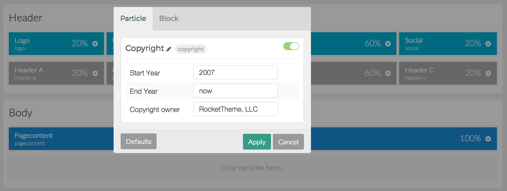

Would you like to change where the Logo appears on your site? How about adding a new positions for modules/widgets and placing it directly below the menu? You can do these things and more without even touching your keyboard thanks to a new concept to the Gantry Framework called **Particles**.

Gantry5’s Layout Manager gives you the power to create a virtually unlimited amount of Particles, including Positions, resize them, and place them just about anywhere you want them to appear on the frontend. 

There are three basic types of Particles. Here is a quick breakdown of what they are, and the role they play in your website.

| Type              | Description                                                                                                                                                                                                                                                                                 |
| :-----            | :-----                                                                                                                                                                                                                                                                                      |
| Standard Particle | Referred to as **Features** in previous versions of Gantry, these are small, modular blocks with preset scripting that enable you to **add elements to your page**. Particles can have simple or complex sets of options which enable you to further customize how they appear on the page. |
| Position          | Position Particles are blocks that can have **content or scripting assigned to them by the CMS**. The content body, as well as widget/module positions fall under this category.                                                                                                            |
| Atom              | Atoms are **non-visible** Particles which provide scripting to your site. Analytics tracking, custom CSS / JavaScript, and other elements that need to **run when the page loads but do not appear visually** fall in this category.                                                     |

Standard Particles
-----

For theme developers, particles can be created in minutes, and they can add functionality to your page in an environment that is easy for your clients to navigate and work with.

Instead of pointing them to a Custom HTML (Joomla) or Text (WordPress) widget, where they have to navigate through supporting code to make small adjustments, you can send them to the Gantry Administrator where they can change values in pre-configured fields without ever having to look at a single line of code.

Positions
-----

Positions are Particles that have content assigned to them by the CMS. In most CMS frameworks, these are hard-coded in the theme. In Gantry5, you can freely create, move, and remove them as you please using the **Layout Manager**.



Positions can be both renamed for reference on the backend and rekeyed, allowing you to set the **Key** modules are assigned to. This makes migration from other templates which likely won't have the same positions naming scheme easier. Since migration will likely happen from a template that does not share the same position naming scheme, you can easily rekey the Positions rather than having to reassign modules one-by-one.




Coming Soon...




Coming Soon...




Coming Soon...




Coming Soon...


{{ gravui_tabs({'Joomla':tab1, 'WordPress':tab2, 'phpBB':tab3, 'Magento':tab4, 'Grav':tab5}) }}

Atoms
-----

Atoms, which are particles that do not render on the frontend in any visible fashion, make it easy to add scripts such as custom CSS or JS, as well as tracking methods like Google Analytics. You can even arrange their order in their Section to determine the order in which they load during page rendering.
