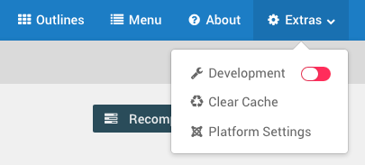

Adding a custom style sheet is a fairly straightforward process. The first thing you should do is create the custom SCSS/CSS file. You can do so in just about any text editor.

 {.border .shadow}

To do this, navigate in the directory structure to `THEME_DIR/custom/scss` and create a file called `custom.scss` if one doesn't already exist. If the `/custom/scss/` directory doesn't exist, you will need to create that, too. If it already does, just open it and make your additions/changes directly to the file.

>>>> Joomla doesn't support creating SCSS files in its built-in template customization tool.

This file will then be compiled as an override to the theme's core style sheet files. Anything you place in this file will override classes and defaults assigned in other areas of the theme.

You can format the file's content in either **SCSS** or **CSS**. Gantry will automatically pick it up and compile it properly.

Once you have added this file, and put your custom CSS/SCSS within, Gantry will do one of two things. This activity is determined by the **Production Mode** setting. You can reach this setting by navigating to **Gantry 5 Administrator > Extras**.

 {.border .shadow}

If you have **Production Mode** set to **Yes**: you will need to then navigate to the Gantry 5 administrator, select the **Styles** administrative panel, and click **Recompile CSS** for the outlines you wish to have the custom styling apply for. 



 {.border .shadow}




 {.border .shadow}


{{ gravui_tabs({'Joomla':tab1, 'WordPress':tab2}) }}

If **Production Mode** is set to **No**, then Gantry will recompile the CSS/SCSS automatically when changes are made. In the future, more **Development** vs. **Production** actions will be tied to this same setting, such as Cache, minified vs. extended JS/CSS, etc.

>>>> We do not recommend editing or overriding the `css/custom.css` or `css-compiled/custom.css` files as any of these changes will be lost and/or overridden when the custom.scss file recompiles. You can place pure CSS in the `custom.scss` file and it will work just fine.

This will tell Gantry to take the new styling and apply it to the page(s). Once you have done this, you should be able to see your changes on the front end.

>>>> If you come across an error when you hit **Recompile CSS** this is likely due to an issue in the SCSS/CSS. At this stage, the compiler is pretty unforgiving and any syntax issues can cause issues. Double-check your code, save your changes to the `custom.scss` file, and try again.

## Dependencies.scss

We have consolidated the includes for **Bourbon**, **Nucleus**, **theme mixins**, and **variables** into a `_dependencies.scss` file. You can now just import this one file to have it all. Use `@import "dependencies";` in your `custom.scss` file to import it.