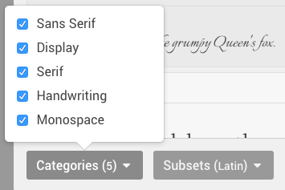
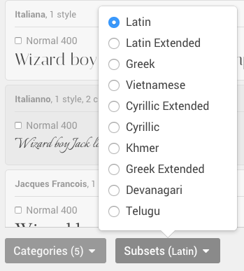
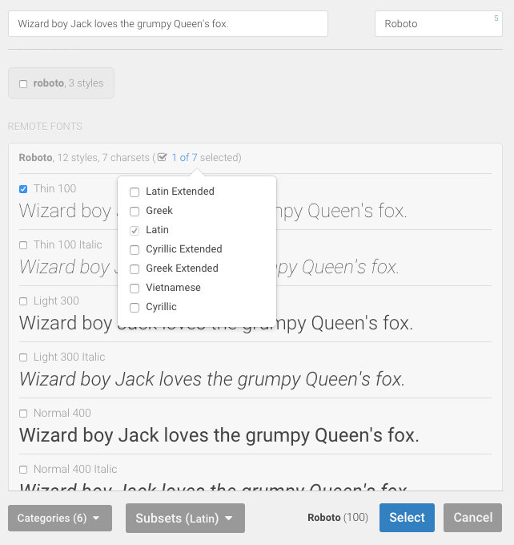

Gantry 5 includes a new **Font Picker** which gives you the ability to select fonts for a variety of situations including templates, Particles, and more.

The Font Picker makes it easy to quickly choose fonts in Particles. The picker itself pops up when you click a special field in the backend that gives you the ability to set a font for a Particle, or even for the theme itself.

Based on **Google Fonts**, the Font Picker gives you immediate access to over 600 open source fonts.

>>> You can find more information about adding a font to the font picker (as well as to your theme in general) [in our fonts guide](../fonts).

## Browsing Fonts


Test Text Field [3%, 1%, se]
    : Enter the text you would like to see in different fonts here.

Search [3%, 83%, se]
    : Use this field to search for a font by name. The number in the upper-right corner of the field indicates how many matches there are to your current string.

Font Browser [10%, 1%, se]
    : Available fonts are listed in this area of the **Font Picker**. You can scroll down to see all of the different options, each displaying your test text in the associated font.

Categories [91%, 1%, se]
    : This setting enables you to filter fonts by category. This is a useful tool for refining your search by type of font, rather than scrolling through the entire library.

Subsets [91%, 15%, se]
    : This setting gives you the ability to filter results by subset. For example, you could look for a font specifically in Latin characters.

Select [91%, 86%, se]
    : Use the green **Select** button to lock in your font of choice (listed in the text directly to the left). To choose a font, simply select the checkbox in that font's listing in the font browser.



{{ gravui_callout(page.media['font_picker_1.png'].url, callout_items, 'shadow border') }}

1. **Test Text Field**: Enter the text you would like to see in different fonts here.
2. **Search**: Use this field to search for a font by name. The number in the upper-right corner of the field indicates how many matches there are to your current string.
3. **Font Browser**: Available fonts are listed in this area of the **Font Picker**. You can scroll down to see all of the different options, each displaying your test text in the associated font. To select a font, click the checkbox located to the left of the font's weight you would like to use.
4. **Categories**: This setting enables you to filter fonts by category. This is a useful tool for refining your search by type of font, rather than scrolling through the entire library.
5. **Subsets**: This setting gives you the ability to filter results by subset. For example, you could look for a font specifically in Latin characters.
6. **Select**: Use the green **Select** button to lock in your font of choice (listed in the text directly to the left). To choose a font, simply select the checkbox in that font's listing in the font browser.

Upon clicking the font icon to the right of the **Font Picker** field, a popup appears that enables you to type a phrase and see it presented in over 670 different fonts from the [Google Font](http://www.google.com/fonts) library.

 {.border .shadow}

To make life a little easier, you can filter these results by Category and Subset, as well as search for a specific font using the search tool in the upper-right corner of the popup.

 {.border .shadow}

This is a very quick and easy way to not only get a preview of what a block of text might look like with a different font, but to apply that font to your page by simply choosing it and hitting **Select**.

## Selecting Your Font Weight(s) and Character Set(s)

 {.border .shadow}

You have the ability to quickly and easily select font weights and character sets within the Font Picker. Selecting these here will make them available in your theme. 

The font weight (thin, light, normal, etc.) determines how the font appears on the front end. This can be a great way to differentiate titles and subtitles from your content, enhance your site's general typography, and more.

Character sets are especially useful for multi-language sites as they enable you to utilize Latin, Greek, Cyrillic, etc. characters. You can select one or more character sets, though not all fonts support additional character sets.

Here are the steps you would follow to access these controls:

* Open the Font Picker from the back end of Gantry.
* Search for a specific font you would like to use in the Search field. (For example: `Roboto`)
* Select the check box next to the font weight(s) you would like to use.
* Select the number of character sets selected link at the top of the font's listing.
* Select the character set(s) you would like to use. 

## Using the Font Weight(s) in Your Site

Now the font weights are available in the theme they can be added to the site with **css**.

**Example**

The font selected in the example is `Exo:800`

```css

.your-element{
  font-weight:800;
}

```

Replace `.your-element` for the id(#) or class(.) of the element
Replace `800` for the selected variation

>>> The Roboto and Ubuntu fonts are one of the most completed fonts that are part of the Google Font Library. 

>>>> Not all of the fonts inside the Google Font Library have variations!

## Adding the Font Picker to Your Site

 {.border .shadow}

The Font Picker is a Gantry 5 input. If you want to add it to your template or particle, you would do so by assigning the administrative input as `input.fonts` in the Particle's YAML file.

Here is an example of how this would look in the YAML file.

```yaml
target:
      type: input.fonts
      label: Font
      description: Select the font you would like to have used for content in the Particle.
      default: family=Inconsolata:700,400&subset=latin,latin-ext
```

You can find more information about how to use YAML files in Gantry 5 [in our guide](../../advanced/particle-yaml-field-types).
