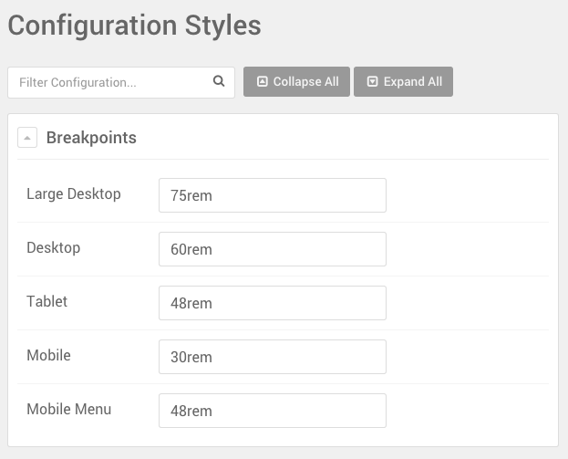

Media queries make it possible to apply CSS only to a specific screen type. For example, if you have an element on your page that you would like to appear differently on phones than it does on a desktop.

Gantry 5 makes easy to do, and this guide will take you through the process of defining breakpoints, as well as adding media queries to your `custom.scss` file.

## Defining Breakpoints

Because Gantry 5 gives you the ability to easily define the breakpoints between viewport types, you can create a user experience that optimized for a wide range of device types with ease.

 {.border .shadow}



Gantry 5 templates include four key breakpoints that are defined by `rem` units. You can set the breakpoints in the **Styles** administrative panel within the Gantry 5 administrator. To access this panel, navigate to **Administrator → Components → Gantry 5 Themes → Your Theme** and select the **Styles** tab. Because this tab is Outline specific, you can change these settings on per-outline basis.




Gantry 5 templates include four key breakpoints that are defined by `rem` units. You can set the breakpoints in the **Styles** administrative panel within the Gantry 5 administrator. To access this panel, navigate to **Administrator → Theme Settings** and select the **Styles** tab. Because this tab is Outline specific, you can change these settings on per-outline basis.


{{ gravui_tabs({'Joomla':tab1, 'WordPress':tab2}) }}

If you're not familiar with `rem` units. There is an excellent explainer below produced by [Russ Weakley for SitePoint](http://www.sitepoint.com/css3-rem-units/). Additionally, you can read a [detailed guide from W3](http://www.w3.org/TR/2013/CR-css3-values-20130730/#font-relative-lengths).

[plugin:youtube](https://www.youtube.com/watch?v=XbU-i1SE5JY) 

## Using Media Queries on Your Site

Using your own media queries can be done very easily within your `custom.scss` file. You can find out more about creating this file and how it works in our [detailed guide](../adding-a-custom-style-sheet).

Below is an example of the code you would add to your `custom.scss` file to enable you to quickly and easily hook in to Gantry 5's breakpoints. 

One important line to note is `@import "nucleus/mixins/breakpoints";` which loads the [**_breakpoints.scss**](https://github.com/gantry/gantry5/blob/develop/engines/common/nucleus/scss/nucleus/mixins/_breakpoints.scss) file, making the mixin breakpoint available to use.

```scss
// Gantry 5 custom CSS file
 
// import breakpoints
@import "dependencies";
 
// Typical values are the default breakpoints set in Gantry 5
// but these values are user definable in style settings
// so that is why the code below uses mixins to get the actual 
// values from Gantry 5 template.
 
// commonly used media queries
 
//  typically min 75rem 
@include breakpoint(large-desktop-range) {
 
}
// typically range 60rem to 74.938rem 
@include breakpoint(desktop-range) {
 
}
 
// typically 48rem to 59.938rem
@include breakpoint(tablet-range) {
 
}
// typically 30rem to 47.938rem
@include breakpoint(large-mobile-range) {
 
}
// typically max 30rem
@include breakpoint(small-mobile-range) {
 
}
 
 
// Less commonly used media queries
 
 
// typically min 60rem
@include breakpoint(desktop-only) {
 
}
// typically min 48rem
@include breakpoint(no-mobile) {
 
}
// typically max 47.938 rem
@include breakpoint(mobile-only) {
 
}
// typically max 59.938rem
@include breakpoint(no-desktop) {
 
}

// Mobile Menu Breakpoint
@media only all and (max-width: $breakpoints-mobile-menu-breakpoint) { ... your css in here ... }

@import "nucleus/mixins/breakpoints"
```

Any CSS that you wish to apply to a specific breakpoint can be added inside the appropriate media query above.
