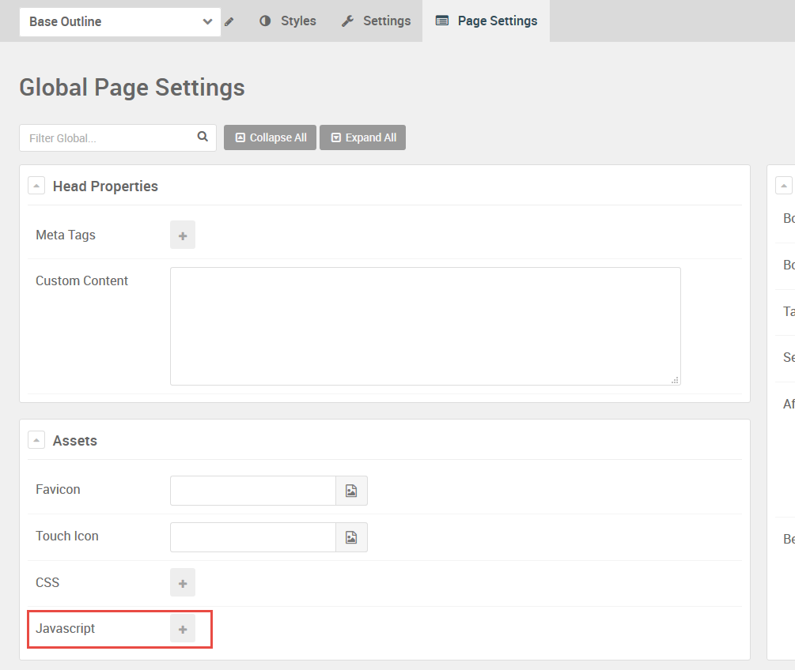

## Introduction

Gantry 5 templates are provided with different particles. Not every particle is not included in every Gantry 5 template, sometimes you might want to include a particle from another template into the template that you are using. This tutorial shows you the safe way to copy particles between templates that won't be overwritten again by template updates.

For the purpose of this tutorial the template you are copying from is the **donor** template and the template you are copying to the **recipient** template.

!!! CAVEATS: 
!!! * If you copy a particle from one template to another, and a bug is subsequently found in that particle, it would only be fixed in the **donor** template (via a template update release). It's therefore your responsibility to watch for **donor** template updates and see if the particle was changed, meaning that you would then need to update the particle in your **recipient** template also.
!!! * It may be that the **donor** template has some special CSS styling for a page/location where that particle is used (e.g. special home page styling). That may not be replicated in copying a particle.
!!! * This is not about changing any functionality - you are copying the particle "as-is".

## What Particles are made of

A particle is made up of these things:

* A YAML (plain text) file that tells Gantry 5 what fields the particle uses
* A TWIG (plain text) file that uses those fields to render output on your page
* A SCSS (plain text) file that contains the SASS/CSS to style the rendered particle on your page
* Optionally, one or more JS (plain text) files that contain JavaScript/JQuery code to make the particle work.

All template specific particles reside in: `/templates/rt_TEMPLATENAME/particles`
All template specific particle SCSS files reside in: `/templates/rt_TEMPLATENAME/SCSS/TEMPLATENAME`
All template specific JS files reside in: `/templates/rt_TEMPLATENAME/JS`

!!! TERMS:
!!! - *TEMPLATENAME* is the name of the template (e.g. isotope, xenon, galatea)
!!! - *PARTICLENAME* is the name of the particle (e.g. newsletter, promoimage, contentlist).

## Copying the Particle

It is very important that you do this copy in such a way that any subsequent template updates do not overwrite what you have done. The steps below ensure that this is the case.

These are the steps to do the copy from the **donor** template to the **recipient** template:

1. Copy `/templates/rt_TEMPLATENAME/particles/PARTICLENAME.html.twig` to `/templates/rt_TEMPLATENAME/custom/particles`

2. Copy `/templates/rt_TEMPLATENAME/particles/PARTICLENAME.yaml` to `/templates/rt_TEMPLATENAME/custom/particles`

3. Copy `/templates/rt_TEMPLATENAME/scss/TEMPLATENAME/_PARTICLENAME.scss` to `/templates/rt_TEMPLATENAME/custom/scss` (note the underscore at the start of the file name).

4. For any JS files that you know to be required by the particle, copy `/templates/rt_TEMPLATENAME/js/JSFILENAME.js` to `/templates/rt_TEMPLATENAME/custom/js`

5. If you don't have a custom.scss file already then you need to create one (plain text file). Your custom.scss file should be put in `/templates/rt_TEMPLATENAME/custom/scss`. Your custom SCSS file must have this statement as the first line:

    ```css
    @import "dependencies";
    ```

The next thing you need to do is to ensure that the SCSS for the particle is loaded too. We do this by including it into our custom SCSS file.

    ```css
        @import "PARTICLENAME";
    ```

    !!! You do **not** preface the *PARTICLENAME* with an underscore.

6. If the particle does use a separate JS file then you need to load that JS file. You do this in your **recipient** template in the base outline on the "page settings" tab.

    

7. The particle that you are copying may also have a dependency on a JS library (e.g. JQuery, Mootools, etc) so you may also need to ensure the appropriate library is loaded too. You do this again on the "page settings" tab of the base outline by dragging the "Javascript Frameworks" Atom onto the Atoms section (if you don't already have one) and then editing the atom settings to toggle on the appropriate framework.

    

8. Go to the base outline "styles" tab and click on "Recompile CSS"

That's it! Now you should be able to use the particle from your **donor** template in your new **recipient** template.