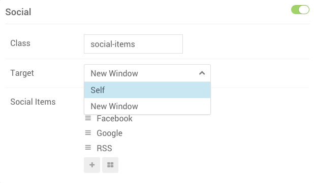
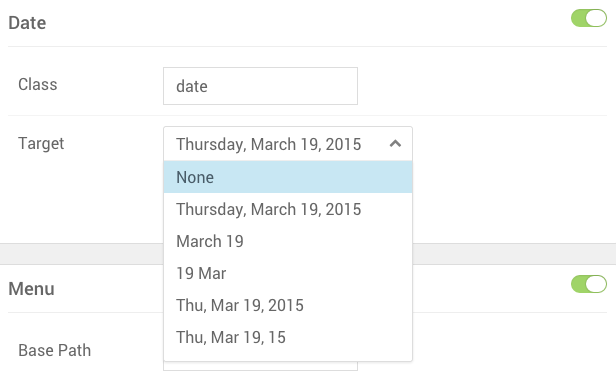

When you are creating a new Particle, you might notice that the input fields you set in the Particle's YAML file vary, depending on what you are trying to accomplish.

 {.border .shadow}

In the above screenshot, you will notice several different types of input fields are present. Even the green switch in the upper-right corner is a field set in the YAML file.

Here is the Particle's YAML file:

```yaml
name: Example
description: Displays a Title, Image, and Text on the front end.
type: particle

form:
  fields:
    enabled:
      type: input.checkbox
      label: Enabled
      description: Globally enable to the particles.
      default: true

    title:
      type: input.text
      label: Title
      description: Customize the section title text.   

    image:
      type: input.imagepicker
      label: Image
      description: Select the main image.

    description:
      type: textarea.textarea
      label: Text / HTML
      description: Create or modify your description.

    css.class:
      type: input.text
      label: Class
      description: CSS class name for the particle.
```

There are several different field types represented in this example. `input.checkbox`, `input.text`, `input.imagepicker`, and `textarea.textarea` can be found in the example above. Below, we have detailed the core field types included with Gantry 5.

HTML Input Field Types
-----

There are two main types of inputs supported by Gantry. The first are basic HTML input types. Gantry supports them for simplicity sake, making it easier for you to create Particles that take advantage of everything HTML has to offer. These types include:

* collection.list      
* input.checkbox | Displays a checkbox (default: true=checked / false=unchecked)                              

```yaml
    title:
      type: input.checkbox
      label: Your lable.
      description: Your description.
      default: true
```
* input.color
* input.date           
* input.datetime-local 
* input.datetime       
* input.email          
* input.file           
* input.group          
* input.hidden         
* input.image          
* input.month          
* input.number         
* input.password       
* input.radio          
* input.range          
* input.reset          
* input.search         
* input.submit         
* input.tel            
* input.text 

```yaml
    title:
      type: input.text
      label: Your lable.
      description: Your description
```

* input.time           
* input.url            
* input.week           
* textarea.textarea    

Gantry-specific Input Field Types
-----

The second are Gantry-specific types that utilize Gantry's exclusive features such as the robust **Color Picker** and **Image Picker**. These types take what the vanilla HTML input types offer and extends them to make them more powerful, easier to use, and exceptionally robust.

| Field Type             | Description                                                                                                                                         |
| :-----                 | :-----                                                                                                                                              |
| input.block-variations | Enables you to select between Gantry's supported block variations, giving you a quick way to refine how the Particle appears on the front end.      |
| input.colorpicker      | Opens Gantry's **Color Selector** which enables you to quickly choose a color from tools displaying hue, saturation, brilliance, and a color wheel. |
| input.filepicker       | Opens Gantry's file browser, enabling you to select a **file** to use.                                                                              |
| input.fonts            | Opens Gantry's **Font Selector** which enables you to view and test over 670 fonts from the **Google Font Library**.                                |
| input.icon             | Opens Gantry's **Icon Selector** which displays and enables you to select FontAwesome icons to use in the field.                                    |
| input.imagepicker      | Opens Gantry's file browser, enabling you to select an **image** to use.                                                                            |
| input.videopicker      | Opens Gantry's file browser, enabling you to select a **video file** to use.                                                                        |
| select.selectize       | Displays a pre-created set of options for the user to choose from.                                                                                  |
| select.date            | Displays a pre-created set of date formats for the users to choose from.                                                                            |

Selectize Fields
-----

`select.selectize` and `select.date` both require a bit of additional setup in the Particle's YAML file to work properly in the Gantry administrator. Below is an example of a `select.selectize` field type from a Particle's YAML field.

```yaml
target:
      type: select.selectize
      label: Target
      description: Target browser window when item is clicked.
      placeholder: 'Select...'
      default: _blank
      options:
          _parent: Self
          _blank: New Window
```

>>> Using Selectize multiple times in a single page can affect performance. If you are in a in a situation where you need to use this input type multiple times in a small space, you could try `select.select` as an alternative. It has roughly the same capability with less performance overhead. A good rule of thumb is that if you don't need the search function, you should use `select.select`.

You will notice the `options` settings listed here. In this case, the values of `_parent` and `_blank` are used with the tags of `Self` and `New Window`. The user will see the tags in the Gantry administrator. Selecting one or another sets the value of the field to the option's associated value.

 {.border .shadow}

As you can see, the user experience in the Gantry administrator is more natural and easier on the user. Instead of entering the target window for a link manually, they simply select between these two preset options, which feeds into the Particle's Twig file during page rendering.

Using the `select.date` field type is very similar. The difference here is that you are giving someone an option in how dates appear. In the example below, we have set up a variety of different options.

```yaml
date.formats:
      type: select.date
      label: Target
      description: Select preferred date format.
      default: l, F d, Y
      placeholder: 'Select...'
      selectize:
        allowEmptyOption: true
      options:
        '': None
        'l, F d, Y': Date1
        'F d': Date2
        'd M': Date3
        'D, M d, Y': Date4
        'D, M d, y': Date5
        'l': Date6
        'l j F Y': Date7
```

Below is how these YAML settings appear in the Gantry 5 administrator.

 {.border .shadow}


Gantry Alerts, Notes and Styling
-----

Next to the standard HTML and Gantry inputs there are also a lot of other inputs. These inputs can be used to alert users or to simply add a bit of styling to the Gantry admin. With notes, you can create subsections and add more information directly available for the user. The following types are included:

* seperator.note

```yaml
   titel:
      type: separator.note
      class: alert alert-info
      content: '<h1>Your HTML GOES HERE</h1><p>Write what you want!</p>'
```

Change the class of the `seperator.note` to any class that corresponds with your template. Standard classes are:

```yaml
      class: alert alert-success
      class: alert alert-info
      class: alert alert-warning
      class: alert alert-danger      
```
There are a lot of different options available to you. As you can tell from this short guide, Particles are a powerful part of Gantry's core functionality, and can utilize a number of features to make life easier on your user.
